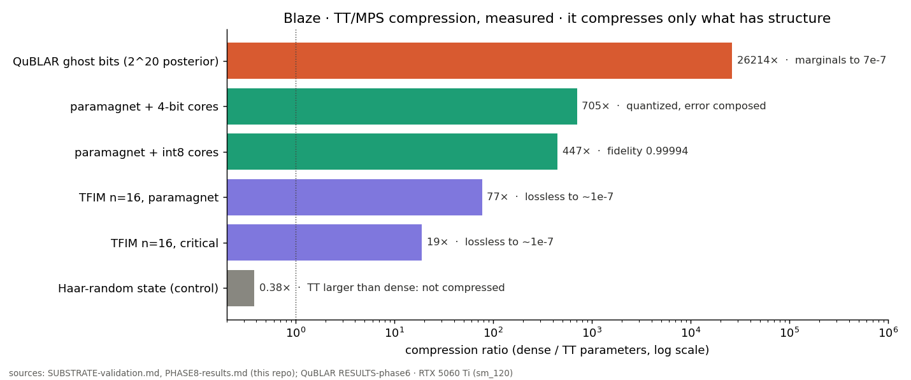
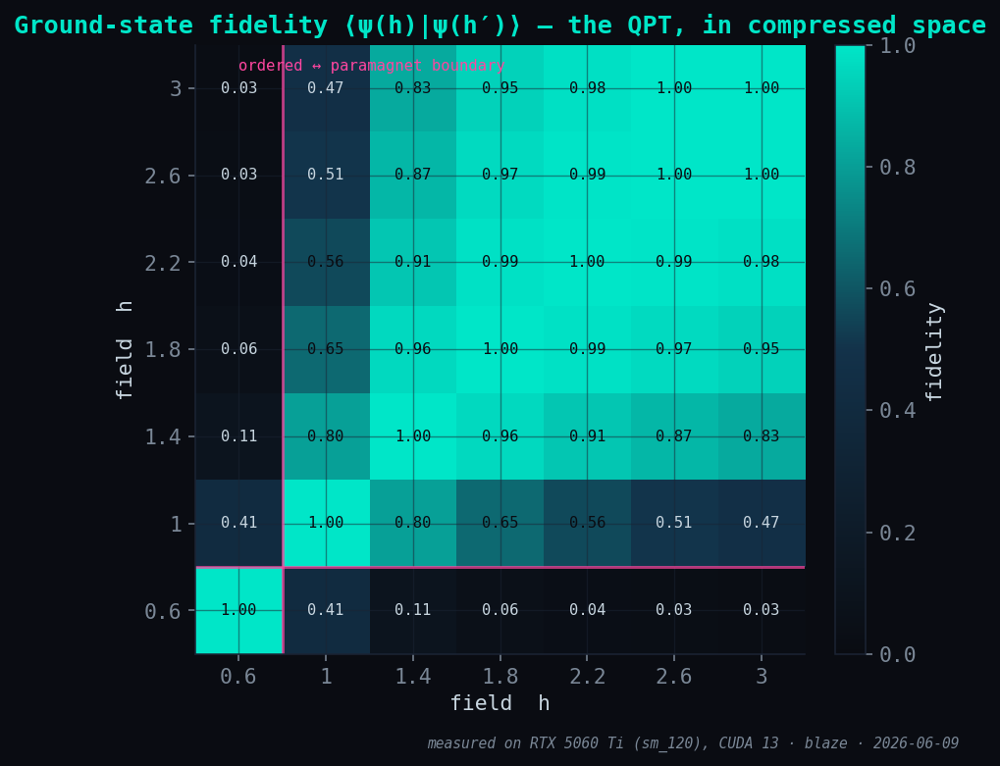
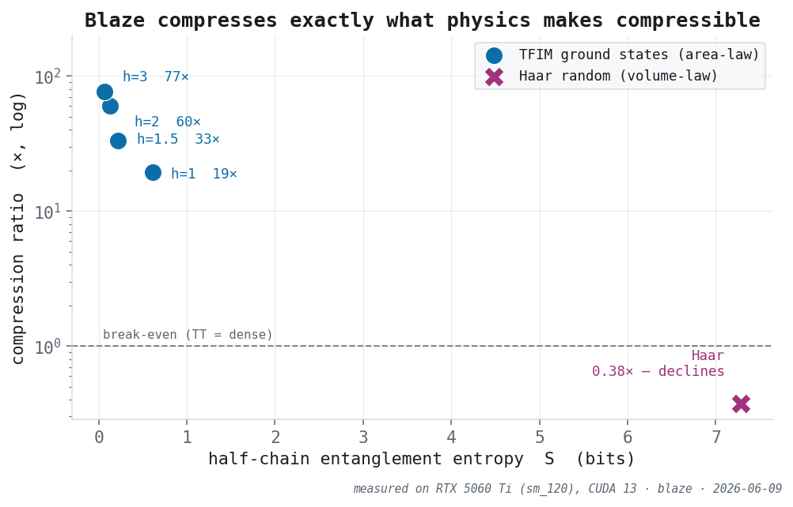
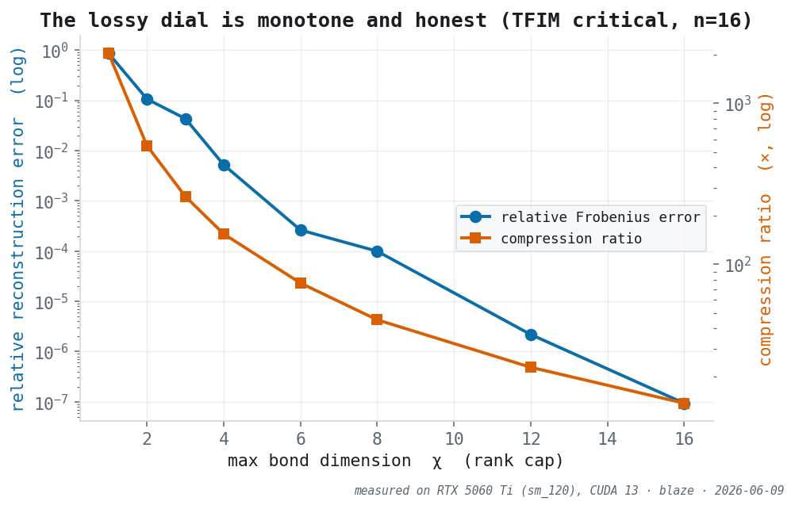
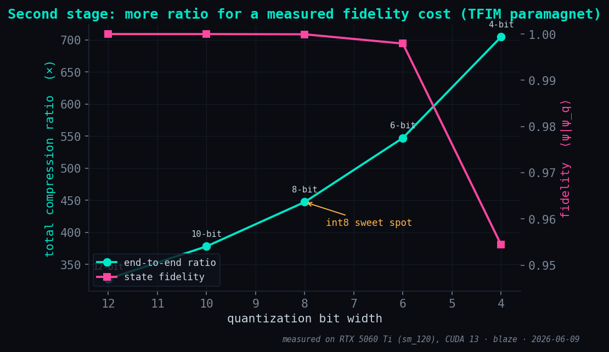
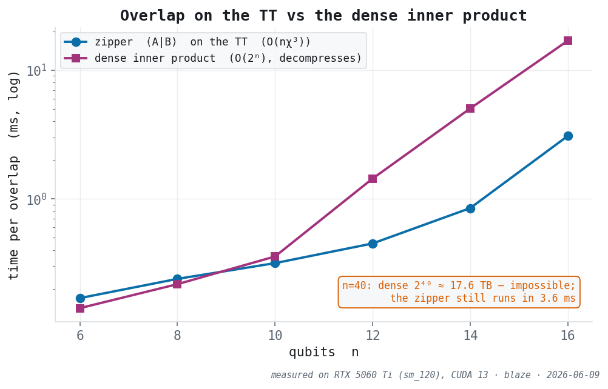

# Blaze — Tensor-Network compression of high-order data

Lossy TT/MPS compression + approximate reconstruction for data with **genuine
tensor-train structure** — primarily **quantum states** (Cirq) and TT-native
scientific tensors — with honest compressibility diagnostics and a load-bearing
quantum layer (the MPS ↔ quantum-circuit correspondence).

**Honest scope (the Phase-1 fair benchmark settled this):** TT only *beats a fair
matrix SVD* on **genuinely TT-native data** — low rank across *every* cut, structure
spread over modes (a low-bond MPS; a **low-entanglement quantum state**, guaranteed by
physics). On generic "structured" data (smooth fields, hyperspectral-like volumes) a
well-chosen single matrix SVD competes at **equal parameters** — "high-order" or
"smooth" is **not** enough; generic high-entropy data doesn't compress at all
(`[KNOWN_LIMIT]`). **Blaze is not a general compressor.** Its real, usable value:
(1) **quantum-state compression + fidelity/sampling**, (2) **honest diagnostics** that
tell you *whether* TT fits your data, (3) fast TT where it does, (4) **operations in
the compressed representation** — inner product, fidelity, distance and exact
similarity search (`TTIndex`) computed on the TT directly, **without decompressing**
(Phase 7, `O(nχ³)` vs `O(2ⁿ)`; see [`docs/PHASE7-results.md`](docs/PHASE7-results.md)),
(5) **a second, composable quantization stage** — int8/4-bit core codes on top of the
TT rank truncation, error measured and composed (Phase 8: TFIM paramagnet 77× → **447×**
at fidelity 0.9999; see [`docs/PHASE8-results.md`](docs/PHASE8-results.md)).
Lossy; compared against the best matrix SVD at matched params, never against lossless Zstd.

Architecture, build sequence, and the honesty contract:
[`docs/ADR-0001`](docs/ADR-0001-blaze-architecture.md).

## Stack (each language where it fits)

`Rust` ingestion · CLI · persistence  ·  `C++/CUDA` TT kernels (hot core)  ·
`Python` TT algorithms + benchmarks  ·  `Cirq` MPS↔circuit bridge

## Status — 8 phases complete (measured on RTX 5060 Ti, sm_120)

Every number below is from a reproducible gate in `tests/` and written up in `docs/`.
Honest baselines, documented `[KNOWN_LIMIT]`s, no overclaim — the contract of
[`docs/ADR-0001`](docs/ADR-0001-blaze-architecture.md) and
[`docs/ADR-0002`](docs/ADR-0002-overlap-and-quantization.md).

| # | Phase | Headline result (measured) | Detail |
|--:|-------|----------------------------|--------|
| 1 | Honest classical benchmark | TT beats a *fair* matrix SVD **only on TT-native data**; generic "structured"/high-entropy data does not compress (`[KNOWN_LIMIT]`, documented not hidden) | [PHASE2 §0](docs/PHASE2-rust-core-spec.md) |
| 2 | Rust core `blaze-core` | 1:1 **parity** with the Python reference (CPU, faer/nalgebra); same ranks, `rel_error` within fp | [lib.rs](crates/blaze-core/src/lib.rs) |
| 3 | CUDA SVD offload (cuSOLVER) | **~2.9× (f64) / ~3.8× (c64)** above the **n≈24 crossover**; below it the CPU wins (transfer/launch-bound — stated, not hidden) | [PHASE3](docs/PHASE3-results.md) |
| 4 | Approximate reconstruction | **monotone** error↔rank dial; `.blz` roundtrip **75×** on a TFIM paramagnet at fidelity **1.000000000000** | [PHASE4](docs/PHASE4-results.md) |
| 5 | MPS → circuit synthesis | sequential state-prep (Schön 2005) reproduces the MPS at **fidelity 1.0** (GHZ, product, physical TFIM); ancilla disentangles | [PHASE5](docs/PHASE5-results.md) |
| 6 | Rust CLI + `.blz` persistence | `blaze compress` / `reconstruct` end-to-end, c64 verified on disk | [blz-format](docs/blz-format.md) |
| 7 | Ops in compressed space | `inner`/`fidelity`/`distance`/`TTIndex` via the MPS zipper, **exact to 1e-15**, `O(nχ³)`; runs at **n=40** (dense 2⁴⁰ = 17.6 TB, impossible) in **3.6 ms**; TFIM search recovers the **quantum phase transition** | [PHASE7](docs/PHASE7-results.md) |
| 8 | Core quantization | int8/4-bit codes on top of TT, error **composed** and measured; TFIM paramagnet **76.6× → 447×** at fidelity **0.99994** (int8), up to **705×** at 4-bit | [PHASE8](docs/PHASE8-results.md) |
| 9 | Search over quantized cores | **Python validated** (9 tests, `tests/test_phase9_quantized_search.py`); the native quantized-overlap kernel is **designed, not built** ([ADR-0003](docs/ADR-0003-quantized-overlap-kernel.md)) | — |

**In use: QuBLAR's ghost bits.** QuBLAR, an Ising photonic engine, enumerates the exact
posterior of the 20 most likely hidden voxels (2²⁰ branches) and hands the 20-way tensor to
Blaze. It compresses to TT rank 1–2 (about 26,000×), and the marginals are read from the TT
to 7 × 10⁻⁷, or 2.7 × 10⁻³ with int8 cores. It compresses that well because the posterior
is sharp, and Blaze's diagnostic says exactly that.

**Flagship validation — real physics ([SUBSTRATE](docs/SUBSTRATE-validation.md)).**
TFIM ground states (n=16) compress **19× (critical) → 77× (paramagnet)** losslessly to
~1e-7, with four independent physics cross-checks (Page value, entropy monotonicity,
TT rank = Schmidt rank, honest decline). The Haar-random control does **not** compress
(**0.38×** — TT larger than dense); Blaze reports this instead of hiding it.

## Benchmarks, visualized

**The card.** Compression ratio against the error that bought it; every bar is a number
already measured in this repository or in QuBLAR, the random control included
(`python docs/bench_card.py`):



Every figure is regenerated **live** from real runs — `python docs/plots.py` (no
hardcoded numbers: TFIM states via quimb, compressed / quantized / overlapped by
blaze itself), on the RTX 5060 Ti (sm_120).

**Ground-state fidelity reveals the quantum phase transition** — each overlap computed
in compressed space (Phase 7), never decompressing a 2¹⁶ statevector. The ordered phase
(`h<1`) is nearly orthogonal to the paramagnet (`h>1`); the sharp drop *is* the QPT:



**Compression tracks physical entanglement.** Area-law TFIM ground states compress
19–77×; the Haar volume-law control falls below break-even (0.38×) and Blaze declines
instead of hiding it:



**The lossy dial is monotone** (Phase 4, left) and **the second quantization stage buys
ratio for a measured fidelity cost** (Phase 8, right):

| | |
|---|---|
|  |  |

**Overlaps run on the TT directly** — `O(nχ³)`, not `O(2ⁿ)`. The zipper still answers at
n=40, where a dense statevector (17.6 TB) cannot even exist (Phase 7):



### Quickstart

```bash
pip install -e '.[quantum]'                              # numpy/scipy + cirq/quimb
pytest -q                                                # 33 gates

python -m blaze.examples.substrate_quantum_state         # flagship: 19–77× on TFIM
python -m blaze.examples.quantum_similarity_search       # Phase 7: search in compressed space
python -m blaze.examples.quantize_sweep                  # Phase 8: TT × quantization, with fidelity
```

```python
import numpy as np, blaze
psi = np.zeros(2**12, dtype=complex); psi[0] = psi[-1] = 2**-0.5   # a GHZ state
tt  = blaze.compress(psi.reshape((2,)*12), rel_tol=1e-10)          # TT/MPS
q   = blaze.quantize_tt(tt, bits=8)                                # second-stage codes
print(blaze.fidelity(tt, q.dequantize()))                         # ~1.0, no decompression
```

### Stack status

`Python` reference — all 8 phases · `Rust` `blaze-core` — Phases 2–6 (parity-gated) ·
`C++/CUDA` — Phase 3 SVD offload (cuSOLVER, f64+c64) · `Cirq` — Phase 5 bridge.
Phase 7–8 are the NumPy reference; their Rust port + CUDA batched overlap are the
documented next steps (ADR-0002).

## License

Licensed under either of [Apache License, Version 2.0](LICENSE-APACHE) or [MIT license](LICENSE-MIT),
at your option. Unless you explicitly state otherwise, any contribution intentionally submitted for
inclusion in Blaze by you, as defined in the Apache-2.0 license, shall be dual licensed as above,
without any additional terms or conditions.
